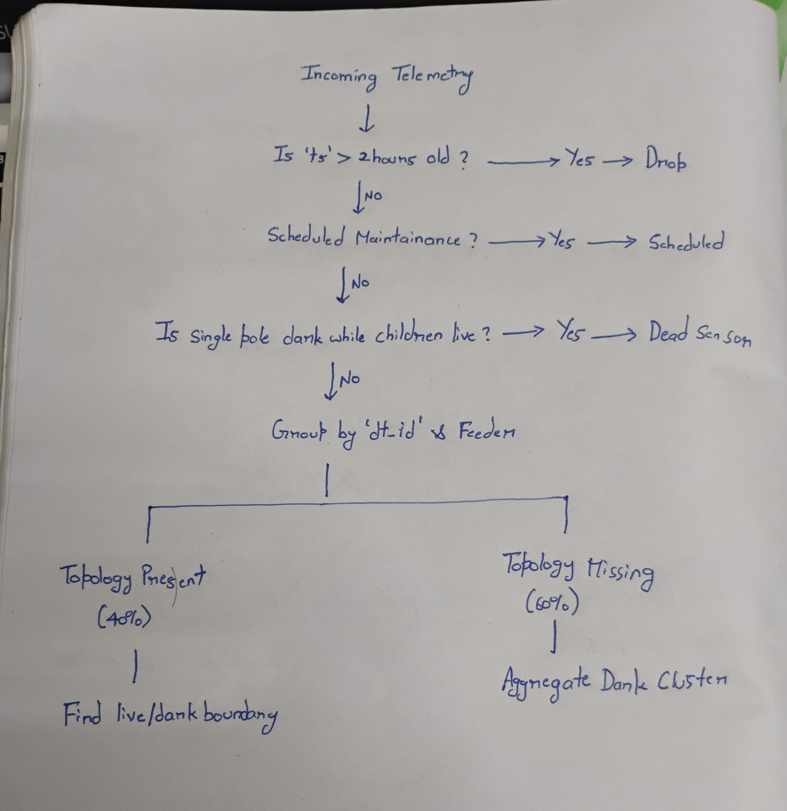

# System Architecture

## 1. Data Flow Diagram
*(A visual representation of telemetry flowing from the physical pole IoT devices, through the ingestion engine, into the fault localization algorithm, and rendering on the operator's control screen.)*

*(Space reserved for hand-drawn/photographed diagram in the root `assets` directory)*

---

## 2. Data Sourcing & Ingestion
The system is built to handle the chaotic reality of physical IoT networks, specifically accounting for 30% packet loss and missing legacy sensors.

* **Arrival:** Telemetry arrives via the `POST /api/telemetry` endpoint. The Node.js Express backend leverages connection pooling to handle concurrent requests without dropping them.
* **Bursts (The Thundering Herd):** When a feeder fails, thousands of devices send `power_lost` gasps simultaneously. The ingestion engine absorbs this burst using Node's asynchronous event loop and PostgreSQL's recycled connection pool (typically 20-30 concurrent connections). The backend returns an immediate `202 Accepted` and processes the DB writes in the background to prevent bottlenecking.
* **Duplicates & Out-of-Order Messages:** The system operates on a "last-write-wins" eventual consistency model for pole status (`is_live: boolean`). If duplicate dying gasps arrive, the database simply overwrites the boolean.
* **Clock Skew:** IoT device clocks are notoriously unreliable. The system ignores device-side timestamps and applies a `CURRENT_TIMESTAMP` strictly at the database ingestion layer, guaranteeing chronological integrity.

---

## 3. Storage & Internal Model
The physical grid is a strict hierarchy (Feeder -> Transformer -> Pole). It has no loops. 

* **Schema:** The network is mapped in PostgreSQL using a standard **Adjacency List** pattern. The `poles` table features a `parent_pole_id` column that points to another row within the same table.
* **Why this representation:** A dedicated Graph Database (like Neo4j) introduces unnecessary infrastructure overhead for a simple, loop-free tree. Furthermore, an Adjacency List maps perfectly into a JavaScript `Map` object.
* **In-Memory Caching:** To avoid running expensive `WITH RECURSIVE` SQL queries during a storm, the backend queries the database exactly once on boot. It builds an in-memory graph in RAM, reducing topology traversal calculations to ~0.001ms.

---

## 4. The Localization Algorithm
The algorithm is designed to be deterministic, overcoming fragmented "Swiss Cheese" data to locate the root cause.

* **Finding the Fault Boundary (The 40%):** For mapped transformers, the algorithm does not look for "live-to-dark" parent-child relationships, because the parent's packet might have been lost in the storm. Instead, it groups all reported dark poles under a specific `dt_id` and runs an `ORDER BY seq_on_line ASC LIMIT 1` query. The pole with the lowest sequence number is the boundary (root cause).
* **The 60% Unmapped Fallback:** For the 60% of transformers lacking `seq_on_line` or parent data, the algorithm degrades gracefully. It abandons span-level calculations and groups all dark poles under that transformer into a single `CLUSTER` alert.
* **Grouping Symptoms:** The `ticketService.js` acts as a debouncer. Before creating a ticket, it checks the database for an active, unverified ticket matching the exact `target_id`. If one exists, it simply updates the `affected_count`, successfully compressing hundreds of symptoms into one incident.
* **Simultaneous Faults:** If multiple grid segments fail at once, they inherently resolve to different root `target_id`s (different `seq_on_line` origins). The debouncer naturally groups them into distinct tickets.
* **Confidence Scoring:** Confidence is implicitly binary based on data availability. Tickets on the 40% mapped grid have High Confidence (exact span). Tickets generated on the 60% unmapped grid have Low Confidence (cluster zone only). 
* **Complexity:** Time complexity for boundary calculation is **$O(N \log N)$** (sorting `seq_on_line` for $N$ dark poles under a DT). Space complexity is **$O(V)$** where $V$ is the total vertices (poles) stored in the RAM cache.
* **Known Failure Cases:** Under extreme, prolonged packet loss (e.g., >80% dropped packets), a contiguous wire break might appear as two isolated groups. The system may briefly generate two tickets before the remaining packets arrive and bridge the gap.

---

## 5. Noise Handling & False Positives
Operators must trust the dashboard. The system aggressively filters false positives.

* **Universal Noise Filter (Dead Sensors):** If exactly `1` pole goes dark on an entire transformer, the algorithm immediately terminates. A real wire break takes out multiple poles; a single isolated failure is mathematically treated as a dead battery or broken sensor. 
* **Scheduled Outages:** Before running localization, the engine hits an external API (`GET /api/outages/active/:dt_id`). If the transformer is under scheduled maintenance, the logic returns early, silently suppressing the alert.
* **Debouncing & Pushback:** If an operator attempts to manually resolve a ticket while the physical telemetry still reports dark poles, the system throws an error and refuses to close it, preventing premature ticket clears.

---

## 6. API Surface

| Endpoint | Method | Path | Purpose | Request Body / Shape |
| :--- | :--- | :--- | :--- | :--- |
| **Ingest** | `POST` | `/api/telemetry` | Accepts high-volume sensor IoT data. | `{ pole_id: string, is_live: boolean }` or Array of objects. |
| **Network** | `GET` | `/api/network` | Fetches grid coordinates for the UI map. | *None* |
| **Tickets** | `GET` | `/api/tickets` | Retrieves active and verified faults. | *None* |
| **Lifecycle** | `PATCH` | `/api/tickets/:id` | Updates ticket status (e.g., assigned). | `{ status: string }` |
| **AI Brief** | `GET` | `/api/tickets/:id/dispatch-summary`| Generates human-readable LLM brief. | *None* |
| **Sim Fault** | `POST` | `/api/simulator/fault` | Injects Span, DT, or Feeder faults. | `{ type: string, target_ids: string[] }` |
| **Sim Repair**| `POST` | `/api/simulator/repair` | Restores power to specific faults. | `{ target_ids: string[] }` |
| **Sim Noise** | `POST` | `/api/simulator/noise` | Kills a sensor while leaving power on. | `{ pole_id: string }` |
| **Mocks** | `GET` | `/api/outages/active/:id`| Checks external maintenance windows. | *None* |

---

## 7. UI Reasoning & Design Choices
* **What the operator sees first:** A split view showing a geographic map of the grid alongside an Active Incident Queue.
* **Why:** Spatial awareness is critical for physical dispatch. Operators need to instantly see the blast radius of a fault geographically while simultaneously having a prioritized, actionable checklist of tickets to work through.
* **What is hidden:** The raw, flashing telemetry stream of individual `power_lost` events is intentionally hidden. The UI abstracts the noise and only presents calculated, debounced boundaries.
* **Expected wrong decision:** Relying on HTTP polling to fetch ticket updates rather than establishing a persistent WebSocket connection. During a massive storm, polling may cause a 3–5 second delay in UI rendering, which might feel slightly stale to a fast-moving operator.

---

## 8. AI Integration: The Dispatch Brief
AI is explicitly kept out of the deterministic fault localization path to prevent hallucinations and latency. 

* **What it is:** An LLM-powered (Groq API) human-readable dispatch summary attached directly to a generated ticket. 
* **Why this spot:** Operators often have to communicate complex database metrics over a radio to physical repair crews. The AI translates raw telemetry, topology, and PIN codes into a prioritized action plan (e.g., "Dispatch 4 workers to PIN 560078 to replace broken wires at P-000028"). It saves the operator mental parsing time.
* **Cost per call:** Using Llama3 on Groq, the strict, short prompt consumes roughly 150 tokens per call, amounting to a fraction of a cent per outage.
* **Failure Fallback:** If the API times out, rate-limits, or becomes unavailable, a `try/catch` block ensures the UI instantly falls back to a hardcoded string template (e.g., `ACTION REQUIRED: Investigate target ${target_id} at PIN ${pincode}`). The system never hangs waiting for the model.